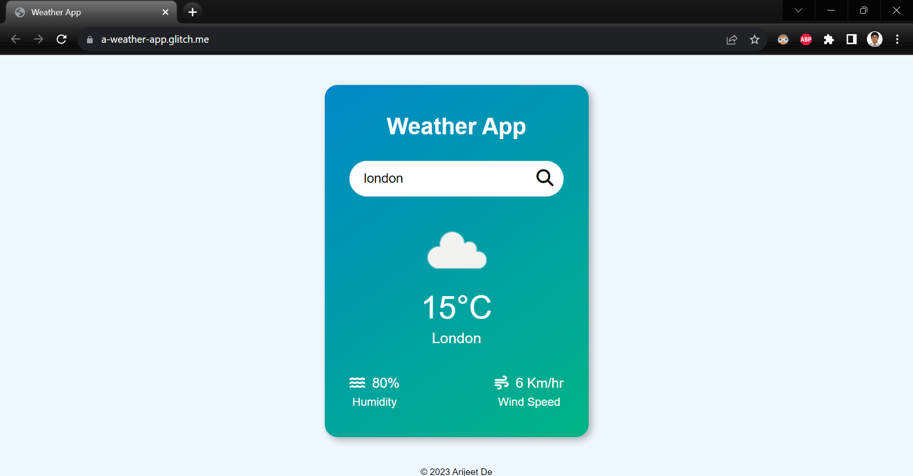

# Weather App

Welcome to my web app called Weather App. Provide a city name and get the weather information.

## Information Provided

- Weather Status
- Temperature
- Humidity
- Wind Speed

## API Used

[OpenWeatherMap](https://openweathermap.org/api)

## Link

Get your city's Weather Information today!  
[Web App Link](https://a-weather-app.glitch.me/)

## Built with

- HTML
- CSS
- Javascript
- No external frameworks

## Screenshot

## Author

- Name: Arijeet De
- GitHub - [@debroglie27](https://github.com/debroglie27)
- Frontend Mentor - [@debroglie27](https://www.frontendmentor.io/profile/debroglie27)
- Facebook - [@arijeet.de](https://www.facebook.com/arijeet.de)
- Instagram - [@121debroglie](https://www.instagram.com/121debroglie/)
